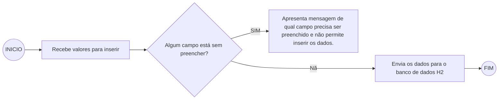

# Api StarWars
Este CRUD inclui, exclui e edita planetas de starwars, além de pesquisar na apo SWAPI quantos filmes o planeta incluido apareceu.

## Tecnologias
* Java 8
* Spring Boot 2.3.1.RELEASE
* Lombok
* JSF
* Primefaces

## Requisitos
* Java 8

## Fluxograma criação/alterar de planetas

## Para execução
Deve baixar o projeto do repositorio um um git clone REPOSITORIO, após deve configurar uma execução com o
tomcat, com a URL http://localhost:8090/star_wars_planets_war_exploded/"